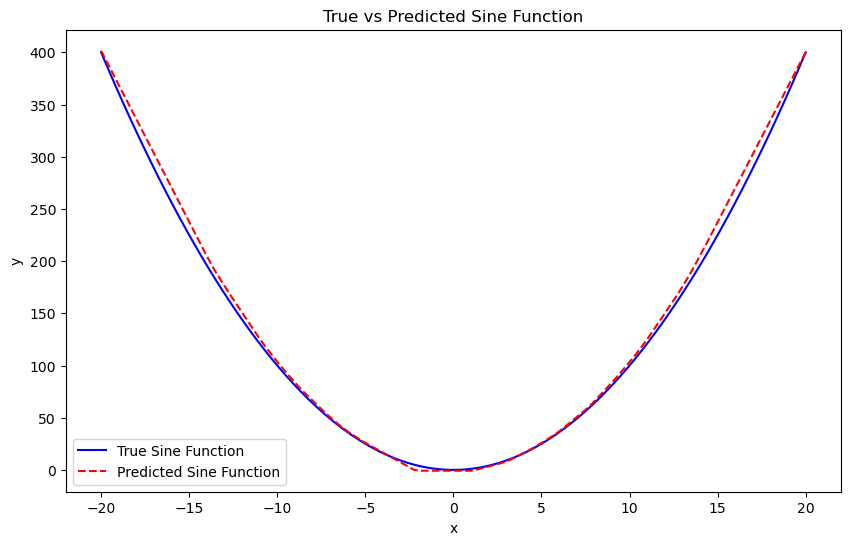

# 函数拟合实验报告
2253711 钟沛橙
## 1. 函数定义

根据理论和实验证明，一个两层的ReLU网络能够模拟任何函数。本实验定义了一个目标函数，并使用基于ReLU的神经网络来进行拟合。我们选择二次函数作为目标函Markdown Preview Enhanced数。即：

\[
y = x^2
\]

---

## 2. 数据采集

为了训练和测试神经网络，我们需要生成训练集和测试集。数据采集过程如下：

1. **训练集**：
   - 输入 \( x \) 从区间 \([-20, 20]\) 中随机采样 1000 个点。
   - 输出 \( y \) 通过二次函数计算得到，即 \( y = x^2 \)。

2. **测试集**：
   - 输入 \( x \) 在区间 \([-20, 20]\) 内均匀采样 100 个点。
   - 输出 \( y \) 同样通过二次函数计算得到。

训练集用于训练神经网络，测试集用于验证模型的拟合效果。

---

## 3. 模型描述

我们使用一个两层的神经网络来拟合二次函数。该网络的结构如下：

1. **输入层**：
   - 输入维度为 1，即单个输入值 \( x \)。

2. **隐藏层**：
   - 包含 200 个神经元，使用 ReLU激活函数。
   - 其定义为：\( \text{ReLU}(z) = \max(0, z) \)。

3. **输出层**：
   - 输出维度为 1，即预测值 \( \hat{y} \)。
   - 不使用激活函数，直接输出线性结果。

4. **损失函数**：
   - 使用均方误差（MSE）作为损失函数，衡量预测值与真实值之间的差异。

5. **训练方法**：
   - 使用反向传播算法更新网络参数。
   - 学习率设置为 0.0005，训练 20000 个周期（epochs）。

---

## 4. 拟合效果

通过训练神经网络并在测试集上进行验证，我们得到了以下拟合效果：

1. **训练过程**：
   - 随着训练周期的增加，损失函数的值逐渐减小，表明网络正在学习二次函数的特征。
   - 在训练过程中，每 1000 个周期输出一次损失值，可以观察到损失值稳步下降。

2. **测试结果**：
   - 绘制真实二次函数和神经网络预测结果的对比图。
   - 从图中可以看出，神经网络能够较好地拟合二次函数的形状，尤其是在函数变化较为平缓的区域。
   - 

3. **总结**：
   - 实验结果表明，一个两层的 ReLU 神经网络能够有效地拟合二次函数。
   - 通过增加隐藏层的神经元数量或调整学习率等超参数，可以进一步提高拟合精度。
