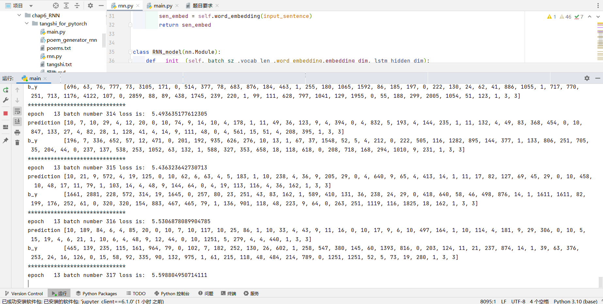
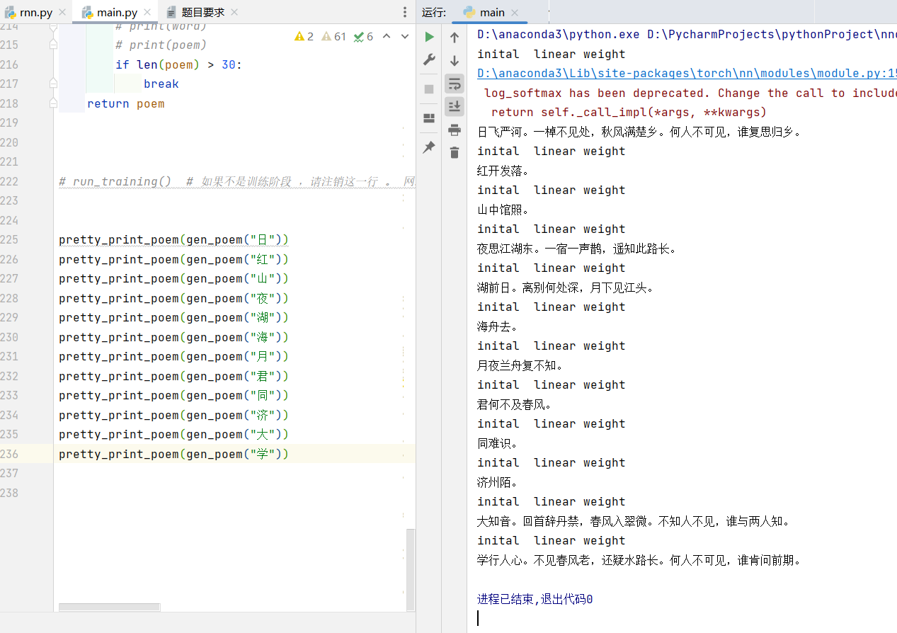

# 诗歌生成报告

## 1. RNN、LSTM 和 GRU 模型简介

### 1.1 RNN（循环神经网络）

循环神经网络（Recurrent Neural Network, RNN）是一类用于处理序列数据的神经网络。与传统的前馈神经网络不同，RNN 具有内部循环结构，允许信息在隐藏状态中传递，以捕捉时间序列的依赖关系。

#### **RNN 结构特点**
- 具有时间步（Time Step）概念，允许信息在多个时间步之间传播。
- 共享参数权重，使其能够处理变长输入序列。
- 存在梯度消失和梯度爆炸问题，导致长期依赖学习困难。

#### **RNN 计算公式**
设输入序列为 \( x_t \)，隐藏状态为 \( h_t \)，权重矩阵为 \( W \)，偏置为 \( b \)，则 RNN 的计算公式如下：

\[
    h_t = \tanh(W_h h_{t-1} + W_x x_t + b)
\]

\[
    y_t = W_y h_t + b_y
\]

其中，\( h_t \) 依赖于前一个时间步的隐藏状态 \( h_{t-1} \)，体现了序列信息的传递。

### 1.2 LSTM（长短时记忆网络）

LSTM（Long Short-Term Memory）是为了解决 RNN 中梯度消失和梯度爆炸问题而提出的一种特殊的 RNN 结构。LSTM 通过引入门控机制来控制信息流，使得模型能够有效捕捉长期依赖关系。

#### **LSTM 结构**
LSTM 由 **输入门（Input Gate）、遗忘门（Forget Gate）和输出门（Output Gate）** 组成，并引入了 **细胞状态（Cell State）**，用于存储长期信息。

LSTM 的计算公式如下：

\[
    f_t = \sigma(W_f [h_{t-1}, x_t] + b_f)
\]

\[
    i_t = \sigma(W_i [h_{t-1}, x_t] + b_i)
\]

\[
    \tilde{C_t} = \tanh(W_C [h_{t-1}, x_t] + b_C)
\]

\[
    C_t = f_t \odot C_{t-1} + i_t \odot \tilde{C_t}
\]

\[
    o_t = \sigma(W_o [h_{t-1}, x_t] + b_o)
\]

\[
    h_t = o_t \odot \tanh(C_t)
\]

其中：
- \( f_t \) 控制遗忘过去的信息。
- \( i_t \) 控制新信息的写入。
- \( o_t \) 控制输出。
- \( C_t \) 是存储长期信息的细胞状态。

### 1.3 GRU（门控循环单元）

GRU（Gated Recurrent Unit）是 LSTM 的一种变体，结构更简洁，计算量更小，效果与 LSTM 相近。

#### **GRU 结构**
GRU 仅包含 **重置门（Reset Gate）和更新门（Update Gate）**，省略了 LSTM 的细胞状态。

GRU 的计算公式如下：

\[
    z_t = \sigma(W_z [h_{t-1}, x_t] + b_z)
\]

\[
    r_t = \sigma(W_r [h_{t-1}, x_t] + b_r)
\]

\[
    \tilde{h_t} = \tanh(W_h [r_t \odot h_{t-1}, x_t] + b_h)
\]

\[
    h_t = (1 - z_t) \odot h_{t-1} + z_t \odot \tilde{h_t}
\]

其中：
- \( z_t \) 控制旧信息和新信息的混合程度。
- \( r_t \) 控制遗忘旧信息的程度。
- \( h_t \) 是最终的隐藏状态。

GRU 由于参数较少，计算效率较高，适用于对计算资源要求较高的任务。

---

## 2. 诗歌生成的过程

### **2.1 模型架构**
#### **2.1.1 词嵌入层（Word Embedding）**
- **作用**：将离散的单词（或汉字）映射为连续的向量表示，使模型能够学习词汇之间的语义关系。
- **实现方式**：
  - 使用`nn.Embedding`层，随机初始化词向量矩阵。
  - 输入：单词索引（`vocab_length` 维的 one-hot 向量）。
  - 输出：`embedding_dim` 维的稠密词向量。

#### **2.1.2 LSTM 层（长短时记忆网络）**
- **作用**：捕捉诗歌文本的长期依赖关系，学习语言模式。
- **实现方式**：
  - 采用双层 LSTM 结构，增强模型表达能力。
  - 输入：词嵌入向量（`(batch_size, seq_len, embedding_dim)`）。
  - 输出：每个时间步的隐藏状态（`(batch_size, seq_len, lstm_hidden_dim)`）。

#### **2.1.3 全连接层（Linear + Softmax）**
- **作用**：将 LSTM 的输出映射回词汇空间，计算每个词的概率分布。
- **实现方式**：
  - `nn.Linear` 层将 `lstm_hidden_dim` 维向量映射到 `vocab_length` 维。
  - `LogSoftmax` 计算对数概率，便于训练时使用负对数似然损失（NLLLoss）。

### **2.2. 训练过程**
#### **2.2.1 数据预处理**
1. **诗歌语料库**：
   - 使用中文诗歌数据集。
   - 清洗数据，去除标点符号、特殊字符。
2. **构建词汇表**：
   - 统计所有出现的字（或词），建立 `word2idx` 和 `idx2word` 映射。
3. **数据编码**：
   - 将诗歌句子转换为数字索引序列。

#### **2.2.2 训练策略**
1. **损失函数**：
   - 采用 负对数似然损失，计算预测词和真实词之间的差距。
2. **优化器**：
   - 使用Adam 优化器，自适应调整学习率。
3. **训练方式**：
   - 训练时使用真实的上文词作为输入，而非模型生成的词，以加速收敛。
   -输入数据按 batch 组织，提高训练效率。

### **2.3. 生成阶段**
给定起始词，模型逐步预测下一个字，并作为新的输入。重复该过程，直到生成完整诗句或达到最大长度。

---

## 3. 生成结果
训练时的截图:

生成结果图:

---

## 4. 总结
本次作业通过补充完善一个pytorch版本的基于LSTM的诗歌生成模型，采用词嵌入技术将汉字转化为稠密向量，通过双层LSTM网络学习诗歌的语义和韵律特征，最终使用全连接层和Softmax输出生成结果。实验使用负对数似然损失和Adam优化器进行训练。结果表明，该模型能够学习到古典诗歌的基本语言模式，可以生成具有一定连贯性和诗意的文本。

